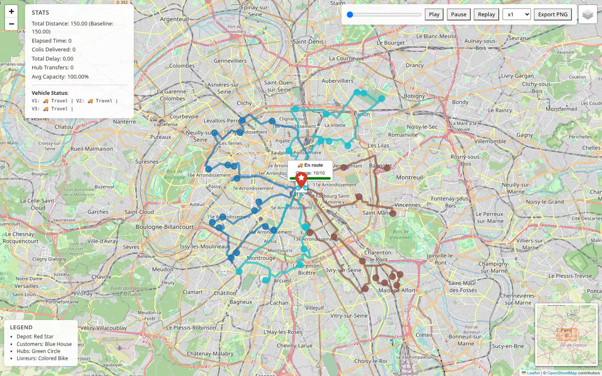
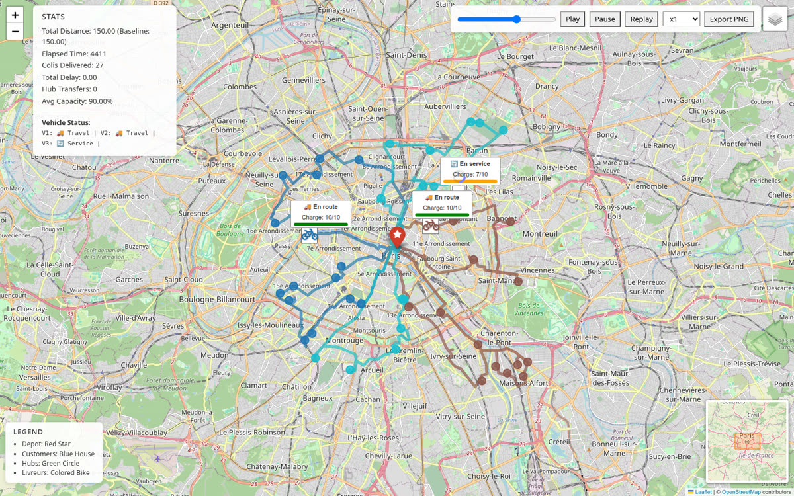
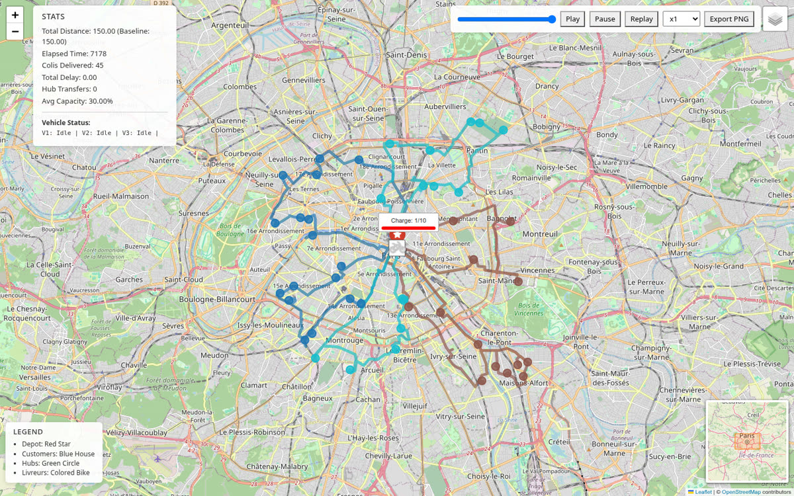

# Optimiseur de tournées de livraison — CVRPTW avec rechargement en hub

> Planification de tournées urbaines sous contraintes de capacité et de fenêtres horaires, avec rechargement en cours de tournée. Résolution par Google OR-Tools, restitution sur carte animée.


---

## La démonstration en une animation

Trois livreurs desservent 45 clients dans Paris. Les vélos suivent **le vrai réseau routier**, la charge de chaque véhicule évolue en direct, et le compteur de colis livrés progresse jusqu'à la fin des tournées.


*Vidéo en meilleure qualité : [`docs/images/demo-tournees.mp4`](docs/images/demo-tournees.mp4)*

---

## Le problème

Un livreur ne peut pas simplement « visiter tous les clients dans l'ordre le plus court ». Il faut composer avec quatre contraintes qui interagissent :

| Contrainte | Ce qu'elle impose |
|---|---|
| **Capacité** | Un véhicule transporte 10 colis au maximum. Au-delà, il doit se recharger. |
| **Fenêtres horaires** | Chaque client accepte la livraison sur un créneau donné. Arriver trop tôt, c'est attendre ; trop tard, c'est un retard pénalisé. |
| **Rechargement** | Le véhicule peut repasser au dépôt ou par un **hub** pour repartir plein, au prix d'un détour. |
| **Équilibrage** | Trois tournées de 2 h valent mieux qu'une de 5 h et deux de 30 min. |

C'est un **CVRPTW** (*Capacitated Vehicle Routing Problem with Time Windows*), un problème NP-difficile : à 45 clients, l'énumération exhaustive est hors de portée. On cherche donc une bonne solution en temps borné, pas l'optimum prouvé.

## L'approche

### Modélisation

Le solveur est bâti sur **Google OR-Tools** (`RoutingModel`) avec trois dimensions :

- **Distance** — l'objectif principal à minimiser ;
- **Capacité** — bornée par véhicule, remise à zéro aux points de rechargement ;
- **Temps** — porte les fenêtres horaires, le temps de service et les attentes.

Deux mécanismes méritent d'être signalés :

**Le rechargement, modélisé par des nœuds fictifs.** OR-Tools ne sait pas nativement « vider » un véhicule en cours de route. Chaque hub est donc dédoublé en deux nœuds, un de dépôt (demande négative) et un de retrait (demande positive), reliés par un véhicule fictif. Le transfert devient une contrainte de routage ordinaire.

**Les clients sont abandonnables.** Chaque nœud est placé en disjonction avec une pénalité (`AddDisjunction`). Plutôt que de déclarer le problème infaisable quand une contrainte ne peut être satisfaite, le solveur peut sacrifier un client à un coût explicite — et le rapport final le signale.

### La question à laquelle le solveur répond vraiment

Les hubs coûtent des détours. Sont-ils rentables ? Le programme **résout le problème deux fois**, avec et sans hubs, puis retient la meilleure solution en temps total de livraison :

```
🎯 COMPARAISON DES SOLUTIONS
   Sans hubs : 5h 56m 55s
   Avec hubs : 30h 27m 33s
   ✅ Solution SANS hubs retenue (les hubs ajoutent 24h 30m 38s)
```

Sur ce jeu de données, les hubs ne sont pas rentables : le détour coûte davantage que le rééquilibrage ne fait gagner. C'est un résultat, pas un échec, et l'outil sert précisément à trancher cette question sur des données réelles.

Encore fallait-il que la comparaison porte sur ce qu'elle annonçait. La branche « sans hubs » se contentait jusqu'ici de mettre le compteur de hubs à zéro sans retirer leurs nœuds du problème. Ceux-ci perdaient alors la disjonction qui autorise à les ignorer, et devenaient des passages **obligatoires** : les livreurs traversaient les hubs sous contrainte, pendant que l'indicateur annonçait tranquillement zéro hub activé. Le retrait est désormais effectif ([`strip_hubs`](optimizer/solver.py)), et vérifié par les tests.

## Aperçus

| Départ du dépôt | Tournées en cours | Tournées terminées |
|---|---|---|
|  |  |  |

La carte n'est pas un rendu statique : un curseur temporel rejoue la journée, affiche l'état de chaque véhicule (`En route`, `En service`, `En attente`), sa charge instantanée, et les indicateurs cumulés.

## Installation

```bash
git clone https://github.com/Skeeder1/livraison.git
cd livraison

python -m venv .venv && source .venv/bin/activate
pip install -e ".[dev]"
```

Aucune clé d'API n'est nécessaire : le calcul d'itinéraires utilise le serveur public OSRM et les fonds de carte proviennent d'OpenStreetMap.

## Utilisation

```bash
# Résout le problème et génère la carte animée
python -m optimizer.main

# Ouvre le résultat
xdg-open vrp_visualization.html
```

Le scénario est paramétré dans [`optimizer/config.py`](optimizer/config.py) :

```python
NUM_CUSTOMERS = 45          # nombre de clients à desservir
NUM_VEHICLES  = 3           # nombre de livreurs
NUM_HUBS      = 2           # points de rechargement candidats
TIME_TO_SOLVE = 30          # budget de calcul, en secondes
DEPOT_POSITION = (48.8566, 2.3522)   # Paris, Île de la Cité
RANDOM_SEED   = 42          # None pour un scénario différent à chaque exécution
```

### Résoudre un scénario depuis du code

`python -m optimizer.main` est un programme : il régénère les données, résout,
écrit `vrp_visualization.html`, colore la sortie et reconfigure les flux
standard. Rien de tout cela n'a sa place dans un service web. Pour appeler le
solveur depuis du code, `optimizer/scenario.py` expose le même calcul sous forme
de fonction :

```python
from pathlib import Path
from optimizer.scenario import solve_scenario

tour = solve_scenario(
    {
        "customers": 45,            # nombre de clients
        "vehicles": 3,              # nombre de livreurs
        "hubs": 0,                  # points de transfert entre véhicules
        "capacity": 10,             # colis par véhicule
        "time_windows_binding": False,  # fenêtres horaires réellement serrées
        "budget_seconds": 30,       # budget de recherche
    },
    workdir=Path("/tmp/scenario-1234"),
)

print(tour["stats"]["customersServed"], "clients servis")
print(tour["stats"]["roadKm"], "km parcourus, horizon", tour["horizon"], "s")
```

Le document retourné est autoportant : arrêts géolocalisés, segments tracés sur
le réseau routier, charges, attentes et indicateurs. Son contrat complet est
décrit en tête de [`optimizer/tour_format.py`](optimizer/tour_format.py), et
c'est **la même fonction** qui met en forme un gel hors ligne et une résolution
servie en direct : les deux ont donc la même forme par construction.

Cinq points à connaître avant de brancher cela derrière une route HTTP :

- **`hubs` commande le transfert, et rien d'autre.** À 0, aucun hub n'existe. Au
  delà, chaque hub devient un point d'échange entre véhicules. Il n'y a pas
  d'état intermédiaire : un hub ne porte aucune demande, le traverser sans y
  transférer de colis ne fait qu'allonger la tournée. Sur les données jouet, les
  transferts dégradent nettement les tournées ; c'est un résultat du solveur, et
  c'est justement la question que `optimizer.main` sert à trancher.

- **Une seule résolution.** `main` en enchaîne trois (distance de référence, puis
  avec et sans hubs). `solve_scenario` appelle `solve_vrp` une fois, ce qui
  divise le temps de réponse par trois. En contrepartie, la stratégie de hub
  n'est plus arbitrée : le document décrit la configuration demandée, pas la
  meilleure des deux.
- **Pas d'appel concurrent dans un même processus.** `Config` porte des attributs
  de classe, et la génération des données initialise le générateur aléatoire
  global de NumPy. Deux appels simultanés se corrompraient. Sérialiser les
  appels, ou les isoler dans des sous-processus.
- **Les paramètres sont bornés côté serveur** par `SCENARIO_LIMITS`, avant tout
  calcul : un scénario, c'est du temps CPU.
- **`workdir` est fourni par l'appelant.** Les six fichiers du jeu de données y
  sont écrits puis relus ; rien ne dépend du répertoire courant du processus.

### Regénérer la vidéo de démonstration

```bash
python tools/capture_demo.py --frames 180 --fps 24
```

Le script pilote le curseur temporel image par image dans un navigateur sans interface, puis assemble le tout avec ffmpeg. La capture est ainsi **déterministe**, au lieu de dépendre de la cadence d'animation et de la charge machine.

## Tests

```bash
pytest                  # tout, environ 50 s
pytest -m "not slow"    # boucle rapide, environ 20 s
```

```
77 passed in 53.97s
```

Les tests couvrent l'indicateur de charge, la couche de compatibilité OR-Tools, le contrat du document de tournée et l'API de scénario de bout en bout.

Deux d'entre eux méritent d'être signalés :

- une **sentinelle de régression amont** : elle vérifie que `SetAllowedVehiclesForIndex` est toujours cassé côté OR-Tools, et échouera le jour où le correctif sortira, signalant que notre contournement peut être retiré ;
- un **test de non-régression du scénario de vitrine** (marque `slow`) : il rejoue le scénario de référence, 45 clients et 3 véhicules avec la graine 42, et vérifie qu'il retrouve exactement les mêmes indicateurs (horizon 7 160 s, 150,3 km, 3 rechargements, 45 clients sur 45, arrêts 17/17/20). Il consomme son budget de 30 secondes. La recherche étant bornée en temps, ces valeurs dépendent de la vitesse de la machine : un écart n'est pas nécessairement une régression, et le message d'échec le rappelle.

## Architecture

```
optimizer/
├── config.py           # Paramètres du scénario et du solveur
├── create_toy_data.py  # Génération du jeu de données (reproductible par graine)
├── data_loader.py      # Chargement et mise en forme
├── preprocessor.py     # Calcul de la distance de référence (baseline)
├── solver.py           # Modèle OR-Tools : dimensions, contraintes, hubs
├── postprocessor.py    # Extraction des routes et calcul des indicateurs
├── trace.py            # Lecture d'une solution : attentes, charges, JSON
├── scenario.py         # API : un scénario en entrée, une tournée en sortie
├── tour_format.py      # Contrat du document servi au consommateur web
├── print_solution.py   # Rendu de la carte animée (folium / Leaflet)
├── road_routing.py     # Itinéraires sur le réseau routier réel (OSRM)
├── stats.py            # Analyses comparatives
└── visualization/      # Gabarit HTML, CSS et JavaScript de l'animation

tools/capture_demo.py   # Capture de la démonstration en images et vidéo
tests/unit/             # Tests unitaires
tests/integration/      # Tests de bout en bout de l'API de scénario
features-inventory.md   # Inventaire des fonctionnalités et de leurs tests
```

`trace.py` et `tour_format.py` existent pour une raison précise : sans eux, la
carte animée et l'API se partageraient deux copies du même calcul, qui auraient
fini par diverger. Le rendu Leaflet importe désormais les mêmes fonctions que le
serveur, et la seule dépendance à folium ou matplotlib reste dans
`print_solution.py`.

## Choix techniques notables

**Les tournées suivent les rues, pas des lignes droites.** Relier les clients à vol d'oiseau donne des trajets qui traversent les immeubles et la Seine. Chaque segment est donc remplacé par l'itinéraire routier réel, obtenu auprès d'OSRM. Le choix d'OSRM plutôt qu'OpenRouteService ou GraphHopper tient à un critère précis : **aucune clé d'API**, donc aucun secret à stocker dans un dépôt public. Une requête par tournée (et non par segment) grâce à `steps=true`, un cache disque, et un repli silencieux en lignes droites si le réseau est indisponible — le projet reste exécutable hors ligne.

**Le facteur distance→temps est calibré physiquement.** Les distances sont euclidiennes, exprimées en degrés. Leur conversion en secondes repose sur ~85 km par degré à la latitude de Paris et une vitesse moyenne de 20 km/h en circulation urbaine, soit ~15 000 s par degré. Vérification face à OSRM : 750 s prédites contre 801 s mesurées sur une traversée de 4,7 km.

**Un contournement documenté d'une régression amont.** Depuis OR-Tools 9.15, `SetAllowedVehiclesForIndex` est inutilisable depuis Python — la signature C++ est passée à `absl::Span<const int>` sans typemap SWIG ([or-tools#4982](https://github.com/google/or-tools/issues/4982)). Le contournement contraint directement la variable de véhicule du nœud, en préservant le sentinelle `-1` sans lequel les disjonctions deviendraient inopérantes.

## Limites connues

Ce projet est un prototype de recherche opérationnelle, et quelques simplifications sont assumées :

- **Les distances du solveur sont euclidiennes**, pas routières. Les itinéraires OSRM servent à l'affichage et à l'animation, pas encore à alimenter la matrice de coûts — le solveur optimise donc sur une approximation à vol d'oiseau. C'est l'amélioration la plus rentable à apporter.
- **L'indicateur de déséquilibre** se fonde sur la charge résiduelle en fin de tournée, ce qui mesure imparfaitement la charge de travail réelle. Le nombre de clients servis ou le temps par véhicule seraient de meilleurs proxys.
- **Le temps de calcul rapporté est figé à zéro** : il n'est pas encore instrumenté.
- **Les données sont synthétiques**, générées autour de Paris. Le format d'entrée (`colis.json`, `livreurs.json`, `hubs.json`) accepte cependant des données réelles sans modification du code.

## Licence

MIT
